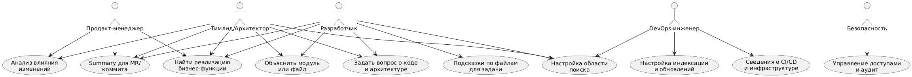

# Формулирование требований к программной системе  
## Тема: Разработка LLM+RAG ассистента для работы в монорепозитории

---

## 1. Заинтересованные лица (стейкхолдеры)

1. **Разработчики продуктовых команд**
   Используют ассистента для поиска кода и документации в монорепозитории, понимания архитектуры и ускорения разработки.

2. **Тимлиды и архитекторы**
   Нуждаются в инструменте для быстрой оценки влияния изменений, контроля архитектурных решений и онбординга новых разработчиков.

3. **DevOps**
   Используют систему для анализа CI/CD-конфигураций, инфраструктурных модулей и интеграции ассистента в существующие процессы.

4. **Продакт-менеджеры**
   Получают от ассистента агрегированную информацию о функциональных модулях, влиянии изменений на бизнес-функции и составе релизов.

5. **Служба информационной безопасности**
   Отвечает за контроль разграничения доступа, отсутствие утечек данных и аудит использования ассистента.

---

## 2. Функциональные требования

1. **Автоматическая индексация монорепозитория**
   Система должна индексировать исходный код, документацию и конфигурационные файлы, разбивая их на логические фрагменты и помещая в поисковое или векторное хранилище.

2. **Инкрементальное обновление индекса**
   При изменении монорепозитория (merge, commit в основные ветки или по расписанию) должны обновляться только затронутые файлы, без полной перестройки индекса.

3. **Ответы на естественно-языковые вопросы о коде и архитектуре**
   Ассистент должен понимать запросы на естественном языке и формировать ответы с указанием конкретных файлов, строк и модулей, на которые он опирается.

4. **Поиск реализаций бизнес-функций**
   Должна быть возможность искать реализацию функционала по описанию предметной области и получать релевантные участки кода и документации.

5. **Объяснение назначения модулей и файлов**
   Система должна кратко описывать, за что отвечает выбранный модуль или файл, опираясь на код, комментарии и связанную документацию.

6. **Анализ влияния изменений**
   По заданному файлу, коммиту или описанию задачи ассистент должен показывать, какие модули, сервисы и бизнес-функции могут быть затронуты изменениями.

7. **Доступ к информации о CI/CD и инфраструктуре**
   Система должна отвечать на вопросы о структуре пайплайнов, окружениях и конфигурации сервисов, используя соответствующие файлы в монорепозитории.

8. **Подсказки, где вносить изменения по описанию задачи**
   По тексту задачи (issue, тикет) ассистент должен предлагать список файлов и модулей, которые с наибольшей вероятностью требуется изменить.

9. **Учёт прав доступа и аудит действий**
   Ответы ассистента должны формироваться только по данным, доступным конкретному пользователю, все запросы и ответы должны логироваться для последующего аудита.

10. **Интерфейсы взаимодействия**
    Система должна иметь веб-интерфейс (чат) и программный API для интеграции с IDE.

---

## 3. Диаграмма вариантов использования

---

## 4. Сделанные предположения

1. Монорепозиторий хранится в Git и использует типовой процесс разработки (ветки, merge-/pull-реквесты).
2. В организации уже есть единая система аутентификации (SSO, корпоративный Identity Provider), с которой ассистент интегрируется.
3. Система разворачивается во внутренней инфраструктуре, данные монорепозитория не передаются на внешние несертифицированные сервисы.
4. Размер монорепозитория достаточно велик, чтобы ручной поиск по коду был трудозатратным и оправдывал применение LLM+RAG.
5. Основные сценарии использования — интерактивные, с ожиданием ответа в пределах нескольких секунд.
6. В монорепозитории используются распространённые языки программирования и типовые соглашения по структуре проекта, что позволяет автоматически выделять модули и логические блоки.
7. Ответы ассистента рассматриваются как вспомогательный инструмент, а окончательное решение о внесении изменений остаётся за разработчиком.

---

## 5. Нефункциональные требования

1. **Качество и релевантность ответов**
   Большинство запросов разработчиков и тимлидов должно приводить к получению релевантных фрагментов кода и документации. Для оценки качества могут использоваться опросы пользователей или ручная проверка выборки запросов.

2. **Допустимое время отклика**
   Время ответа на типовой запрос не должно превышать примерно 5–7 секунд при нормальной нагрузке. Это необходимо для того, чтобы ассистент органично вписывался в рабочий процесс и не тормозил разработку.

3. **Безопасность и разграничение доступа**
   Ассистент не имеет права раскрывать информацию из файлов и модулей, недоступных пользователю в исходной системе контроля версий. Все запросы и ключевые действия должны логироваться, а передача данных осуществляться по защищённым каналам.

4. **Масштабируемость и актуальность индекса**
   Система должна поддерживать индексацию крупного монорепозитория и обеспечивать регулярное обновление индекса для изменённых файлов (например, после каждого слияния в основную ветку или по расписанию), чтобы ответы отражали актуальное состояние кода.

5. **Удобство интеграции и использования**
   Ассистент должен быть доступен через понятный веб-интерфейс и API, а базовые сценарии работы (вопрос о коде, поиск функционала, анализ изменений) должны быть интуитивно понятны без изучения дополнительной документации.

