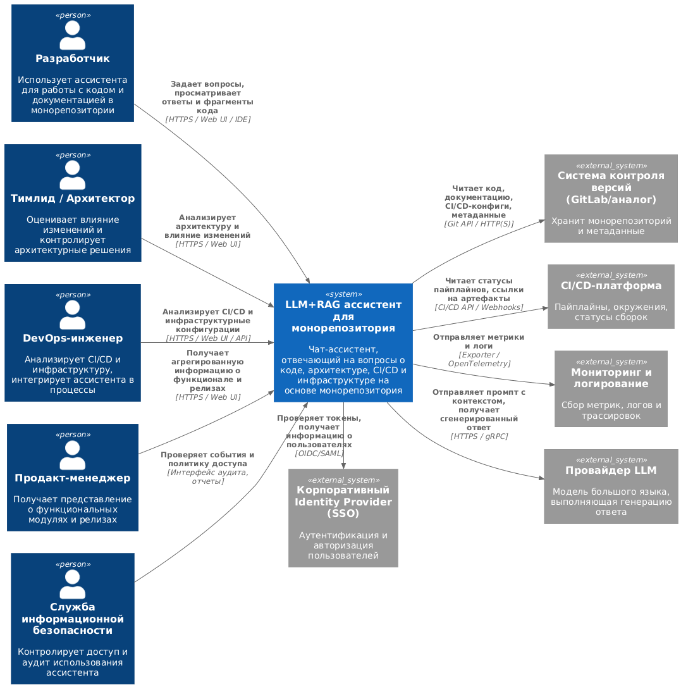

# Лабораторная работа 2  

## Тема: Использование нотации C4 model для проектирования архитектуры программной системы

## 1. Диаграмма системного контекста

Диаграмма системного контекста показывает, как система LLM+RAG ассистента встроена в окружение организации и какие внешние акторы и системы с ней взаимодействуют. На этом уровне не рассматривается внутренняя структура ассистента, а только его границы и связи.

### 1.1. Основные элементы

1. **Пользователи системы**

   - **Разработчики продуктовых команд**  
     Используют ассистента для поиска кода и документации в монорепозитории, понимания архитектуры и ускорения разработки.

   - **Тимлиды и архитекторы**  
     Обращаются к ассистенту для оценки влияния изменений, анализа архитектурных решений и онбординга новых разработчиков.

   - **DevOps-инженеры**  
     Используют систему для анализа CI/CD-конфигураций, инфраструктурных модулей и интеграции ассистента в существующие процессы.

   - **Продакт-менеджеры**  
     Получают агрегированную информацию о функциональных модулях, влиянии изменений на бизнес-функции и составе релизов.

   - **Служба информационной безопасности**  
     Контролирует разграничение доступа, отсутствие утечек данных и аудит использования ассистента.

2. **Система в фокусе**

   - **LLM+RAG ассистент для монорепозитория**  
     Программная система, обеспечивающая интерактивный доступ к знаниям, содержащимся в монорепозитории (код, документация, CI/CD, инфраструктура), с использованием подхода RAG: поиск релевантных фрагментов (retrieval) и генерация ответа на основе модели большого языка.

3. **Внешние системы**

   - **Система контроля версий (GitLab / аналог)**  
     Источник монорепозитория и метаданных (ветки, коммиты, merge-/pull-request’ы).

   - **CI/CD-платформа**  
     Предоставляет информацию о пайплайнах, окружениях и статусах сборок.

   - **Корпоративный Identity Provider (SSO)**  
     Обеспечивает аутентификацию и авторизацию пользователей ассистента.

   - **Система мониторинга и логирования**  
     Собирает метрики, логи и трассировки работы ассистента.

   - **Провайдер LLM**  
     Внешняя или локальная служба, реализующая модель большого языка и выполняющая генерацию ответа на основе предоставленного контекста.

### 1.2. Иллюстрация

---

## 2. Диаграмма контейнеров

Диаграмма контейнеров показывает, из каких приложений и хранилищ данных состоит система, и как эти контейнеры взаимодействуют между собой и с внешними системами. Контейнер в C4 — это развёртываемое приложение или база данных, а не Docker-контейнер.

### 2.1. Основные контейнеры системы

1. **Веб-клиент ассистента (Web UI)**  
   - Тип: веб-приложение.  
   - Назначение: чат-интерфейс, подсветка кода, показ найденных фрагментов, навигация по модулям и веткам монорепозитория.  
   - Пользователи: все роли, взаимодействующие с ассистентом.

2. **Backend API**  
   - Тип: серверное приложение (REST/GraphQL API).  
   - Назначение: приём запросов от Web UI и IDE, управление сессиями диалогов, авторизация, маршрутизация запросов к RAG-сервису, применение политик безопасности и аудит.

3. **RAG-сервис**  
   - Тип: серверное приложение.  
   - Назначение: реализация конвейера Retrieval-Augmented Generation: препроцессинг запроса, retrieval по векторному хранилищу, переупорядочивание результатов (при необходимости), построение контекста и вызов LLM.

4. **Сервис индексирования**  
   - Тип: серверное приложение / фоновые воркеры.  
   - Назначение: периодическое полное и инкрементальное индексирование монорепозитория, нарезка документов на логические фрагменты (чанки), вычисление эмбеддингов и запись их в векторное хранилище.

5. **Сервис интеграции с системой контроля версий**  
   - Тип: серверное приложение.  
   - Назначение: подключение к GitLab (или аналогу) по API, отслеживание изменений (коммиты, merge-/pull-request’ы, обновлённые файлы), постановка задач на переиндексацию.

6. **Векторное хранилище (Vector DB)**  
   - Тип: специализированная база данных для векторного поиска.  
   - Назначение: хранение эмбеддингов фрагментов кода и документации, предоставление поиска ближайших соседей (kNN) для retrieval.

7. **База данных метаданных**  
   - Тип: реляционная СУБД (например, PostgreSQL).  
   - Назначение: хранение данных о пользователях, сессиях, статусах индексации, привязки чанков к файлам/модулям/веткам, журналов аудита.

8. **Очередь сообщений**  
   - Тип: брокер сообщений (Kafka/RabbitMQ или аналог).  
   - Назначение: асинхронная постановка задач на индексирование и выполнение других долгих операций.

9. **Адаптер аутентификации / интеграция с SSO**  
   - Тип: служба или модуль внутри Backend API.  
   - Назначение: работа с корпоративным Identity Provider, проверка токенов и получение информации о пользователях.

10. **Подсистема мониторинга и логирования**  
    - Тип: связка агента/библиотек с внешним стеком (Prometheus, Grafana, ELK и др.).  
    - Назначение: сбор метрик и логов для анализа производительности и качества работы ассистента.

11. **Провайдер LLM**  
    - Тип: внешняя или внутренняя служба генерации текста.  
    - Назначение: приём промпта с контекстом и выдача сгенерированного ответа для пользователя, как часть RAG-конвейера.

### 2.2. Причины выбора архитектурного стиля

В качестве базового архитектурного стиля выбрана **модульная сервис-ориентированная архитектура**, близкая к микросервисной, по следующим причинам:

1. **Разделение ответственности**  
   Индексирование, конвейер RAG, Web UI, интеграция с Git и SSO, а также хранение данных разделены по отдельным контейнерам. Это упрощает развитие и сопровождение системы: можно независимо изменять и обновлять отдельные компоненты.

2. **Масштабируемость по типу нагрузки**  
   Запросы пользователей (интерактивная работа ассистента) и задачи индексирования монорепозитория имеют разные профили нагрузки. Выделение отдельных контейнеров позволяет независимо масштабировать RAG-сервис, сервис индексирования и векторное хранилище.

3. **Гибкость эволюции**  
   Возможна замена провайдера LLM, векторного хранилища или CI/CD-платформы без полной переработки всей системы. При этом логика RAG-конвейера и интерфейсы взаимодействия остаются стабильными.

4. **Интеграция с корпоративной инфраструктурой**  
   Архитектура изначально учитывает существующие SSO, Git-платформу и стек мониторинга, что облегчает внедрение ассистента в инфраструктуру организации.

### 2.3. Диаграмма

---

## 3. Диаграмма компонентов

Диаграмма компонентов фокусируется на внутреннем устройстве одного выбранного контейнера. В рамках данной работы детально рассматривается контейнер **RAG-сервис** как ключевой элемент архитектуры.

### 3.1. Основные компоненты RAG-сервиса

1. **Query Facade (Фасад запросов)**  
   - Принимает нормализованный запрос от Backend API.  
   - Вызывает последовательно остальные компоненты конвейера и возвращает итоговый ответ.

2. **Query Preprocessor (Препроцессор запросов)**  
   - Нормализует текст запроса (язык, регистр, удаление лишних символов).  
   - Извлекает явные указания на ветку, сервис, путь к файлу, технологию.  
   - При необходимости выполняет переписывание запроса (query rewriting), чтобы улучшить качество поиска.

3. **Retriever (Компонент поиска)**  
   - Строит векторное представление запроса.  
   - Обращается к векторному хранилищу и получает набор кандидатов — релевантных фрагментов кода, документации и конфигураций.

4. **Reranker (Компонент переупорядочивания)**  
   - Переупорядочивает кандидатов с учётом дополнительных сигналов (поиск по сырому тексту, архитектурная близость модулей, возможно — отдельная ML-модель ранжирования).  
   - Делит процесс поиска на этапы «быстрый поиск» и «уточнение результатов».

5. **Context Builder (Построитель контекста)**  
   - Группирует выбранные фрагменты по файлам и модулям.  
   - Обрезает и структурирует контекст с учётом ограничений по длине.  
   - Добавляет метаданные (путь к файлу, ветка, ссылки на merge-/pull-request’ы, автор).

6. **Prompt Builder (Построитель промптов)**  
   - Формирует системные инструкции и сценарные подсказки для LLM.  
   - Встраивает подготовленный контекст (фрагменты кода и документации) в промпт.  
   - Поддерживает разные шаблоны промптов для разных типов пользователей (разработчик, тимлид, DevOps и т.д.).

7. **LLM Client (Клиент LLM)**  
   - Инкапсулирует взаимодействие с провайдером LLM.  
   - Обрабатывает таймауты, ошибки, ретраи, выбор конкретной модели.  
   - Обеспечивает единый интерфейс для генерации ответа по заданному промпту.

8. **Answer Postprocessor (Постобработчик ответов)**  
   - Форматирует ответ в удобном для пользователя виде (Markdown, подсветка кода).  
   - Добавляет ссылки на файлы и коммиты в GitLab.  
   - При необходимости применяет фильтры, связанные с требованиями информационной безопасности.

9. **Observability Adapter (Адаптер наблюдаемости)**  
   - Собирает метрики и логи по всем шагам конвейера.  
   - Передаёт данные в систему мониторинга (латентность запросов, количество токенов, ошибки, качество retrieval).

### 3.2. Взаимодействие компонентов

Типовой сценарий обработки запроса:

1. Backend API передаёт запрос в **Query Facade**.  
2. **Query Preprocessor** нормализует запрос и выделяет необходимые параметры (ветка, сервис, тип файла).  
3. **Retriever** выполняет векторный поиск и возвращает набор кандидатов.  
4. **Reranker** переупорядочивает кандидатов по релевантности.  
5. **Context Builder** формирует итоговый контекст, группируя и ограничивая фрагменты.  
6. **Prompt Builder** собирает промпт для LLM с учётом роли пользователя и типа задачи.  
7. **LLM Client** отправляет промпт провайдеру LLM и получает «сырое» текстовое объяснение.  
8. **Answer Postprocessor** форматирует ответ, добавляет ссылки и дополнительные пояснения, передаёт результат в **Query Facade**.  
9. **Observability Adapter** на каждом шаге фиксирует метрики и события, необходимые для анализа качества работы ассистента.

### 3.3. Иллюстрация

