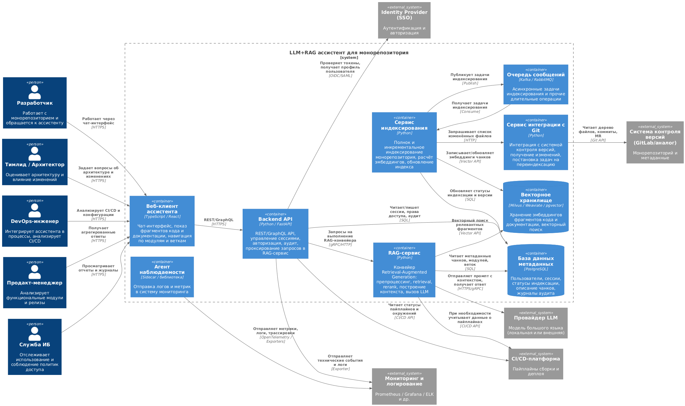
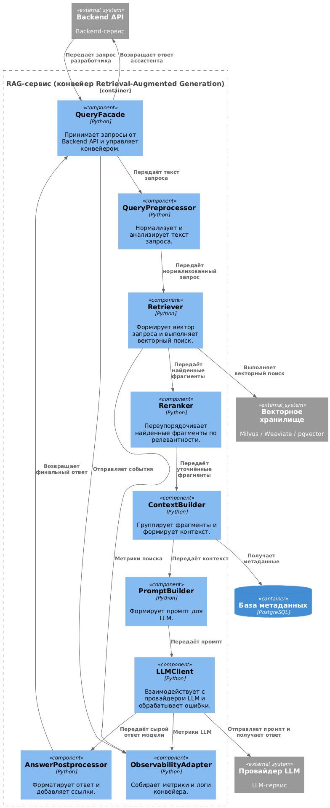
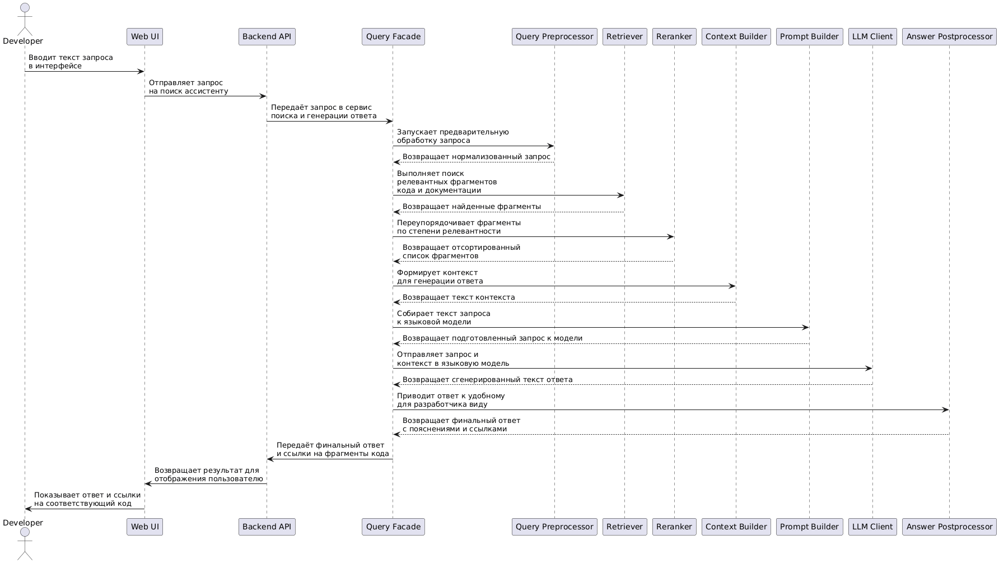
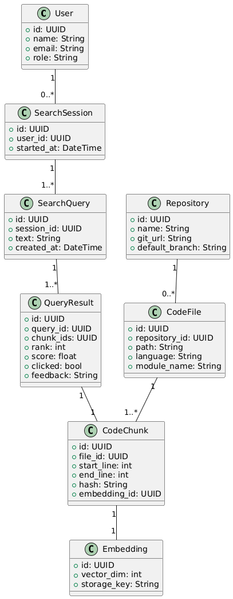

# Лабораторная работа

## Использование принципов проектирования на уровне методов и классов

## Цель работы: Получить опыт проектирования и реализации модулей с использованием принципов KISS, YAGNI, DRY, SOLID и др.

---

## 1.1. Диаграмма контейнеров



## 1.2. Диаграмма компонентов



---

## 2. Диаграмма последовательностей

Вариант использования: «Разработчик задаёт вопрос по коду и получает ответ от ассистента»



---

## 3. Диаграмма классов



---

## 4. Применение основных принципов разработки

### KISS

HTTP-эндпоинт поиска на FastAPI, который делает только одну вещь — преобразует входные данные и делегирует работу конвейеру.

```python
# server/api.py
from fastapi import FastAPI, Depends
from pydantic import BaseModel
from .pipeline import RagPipeline, Query

app = FastAPI()

class SearchRequest(BaseModel):
    user_id: str
    query: str

class SearchResponse(BaseModel):
    answer: str

def get_pipeline() -> RagPipeline:
    from .infrastructure import build_pipeline
    return build_pipeline()

@app.post("/api/search", response_model=SearchResponse)
async def search(req: SearchRequest, pipeline: RagPipeline = Depends(get_pipeline)):
    domain_query = Query(text=req.query, user_id=req.user_id)
    answer = await pipeline.answer(domain_query)
    return SearchResponse(answer=answer.text)
```

### YAGNI

- В текущей версии не реализуется сложная система динамических политик доступа на уровне отдельных фрагментов кода.
- Не добавляются универсальные плагины для произвольных типов документов: реализована работа только с кодом и базовой документацией.
-В RAG-конвейере нет отдельного этапа диалоговой памяти, т.к. сценарии пока ориентированы на одиночные вопросы.

```python
# server/pipeline.py
from dataclasses import dataclass
from typing import List

@dataclass
class Query:
    text: str
    user_id: str

@dataclass
class Answer:
    text: str

class QueryPreprocessor:
    def preprocess(self, query: Query) -> Query:
        normalized = " ".join(query.text.split())
        return Query(text=normalized, user_id=query.user_id)

```

### DRY

DRY реализуется через общий конвейер RagPipeline: логика обработки запроса не дублируется в разных эндпоинтах, а вынесена в один сервис.

```python
# server/pipeline.py
from abc import ABC, abstractmethod

class Retriever(ABC):
    @abstractmethod
    def retrieve(self, query: Query) -> list:
        ...

class Reranker(ABC):
    @abstractmethod
    def rerank(self, query: Query, chunks: list) -> list:
        ...

class ContextBuilder(ABC):
    @abstractmethod
    def build(self, chunks: list) -> str:
        ...

class LlmClient(ABC):
    @abstractmethod
    def generate(self, prompt: str) -> str:
        ...

class RagPipeline:
    def __init__(
        self,
        preprocessor: QueryPreprocessor,
        retriever: Retriever,
        reranker: Reranker,
        context_builder: ContextBuilder,
        llm_client: LlmClient,
    ) -> None:
        self._pre = preprocessor
        self._retriever = retriever
        self._reranker = reranker
        self._context_builder = context_builder
        self._llm = llm_client

    def answer(self, query: Query) -> Answer:
        q = self._pre.preprocess(query)
        chunks = self._retriever.retrieve(q)
        ranked = self._reranker.rerank(q, chunks)
        context = self._context_builder.build(ranked)
        prompt = self._build_prompt(q, context)
        raw = self._llm.generate(prompt)
        return Answer(text=self._postprocess(raw))

    def _build_prompt(self, query: Query, context: str) -> str:
        return f"User question: {query.text}\n\nRelevant code:\n{context}"

    def _postprocess(self, raw: str) -> str:
        return raw.strip()
```

### SOLID

Каждый класс выполняет одну чёткую задачу:
- QueryPreprocessor — только нормализация запроса.
- RagPipeline — только оркестровка этапов.
- VectorStoreRetriever (реализация Retriever) — только доступ к векторному хранилищу.

```python
# server/retriever.py
from .pipeline import Query, Retriever

class VectorStoreRetriever(Retriever):
    def __init__(self, vector_store_client) -> None:
        self._store = vector_store_client

    def retrieve(self, query: Query) -> list:
        return self._store.search(query.text, top_k=30)
```

## 5. Применение продвинутых принципов разработки

### BDUF

- Для учебного проекта LLM+RAG-ассистента полный BDUF не используется.
- Применяется только высокоуровневое проектирование, которого достаточно, чтобы избежать архитектурных ошибок (жестких связей, невозможности масштабирования).

Детальная проработка (конкретный формат индекса, структура промптов, схемы БД) выполняется итеративно по мере появления новых требований.

### SoC

Принцип разделения ответственности явно используется:
1. Уровень представления (Web UI, IDE-плагин).
2. Уровень сценариев и бизнес-логики (RagPipeline, компоненты RAG-конвейера).
3. Уровень инфраструктуры (доступ к БД, векторному хранилищу, LLM-провайдеру, логирование).

Каждый слой решает свою задачу и взаимодействует через чёткие интерфейсы. Это упрощает:
- замену векторного хранилища или провайдера LLM;
- развитие UI без изменений в конвейере;
- тестирование отдельных слоёв.

### MVP

В рамках ЛР3 фактически формируется архитектура и реализация MVP-версии ассистента, которая:
- поддерживает один основной сценарий — ответ на вопрос разработчика по коду;
- имеет один эндпоинт поиска;
- сохраняет минимум данных в БД.

Это позволяет быстро проверить полезность ассистента на реальных пользователях

### PoC

Отдельный PoC имеет смысл для технически рискованных частей:
- качество векторного поиска по реальному монорепозиторию;
- скорость ответа при типичной нагрузке;
- интеграция с выбранным провайдером LLM.

PoC может быть выполнен в виде:
- небольшого скрипта, индексирующего один сервис и проверяющего качество поиска;
- прототипа без полноценной авторизации и UI, только API и простого CLI;
- изолированного теста работы LLM-клиента с реальными примерами кода.
