# **GoF**
## **Порождающие паттерны**
### **Abstract Factory (Абстрактная фабрика)**
Предоставляет интерфейс для создания семейств взаимосвязанных объектов без указания их конкретных классов.

В системе LLM+RAG ассистента паттерн используется для создания согласованного набора компонентов под выбранный стек провайдера:
- LLMClient
- Embedder
- Reranker
Это позволяет переключать реализацию без изменения кода RAGService

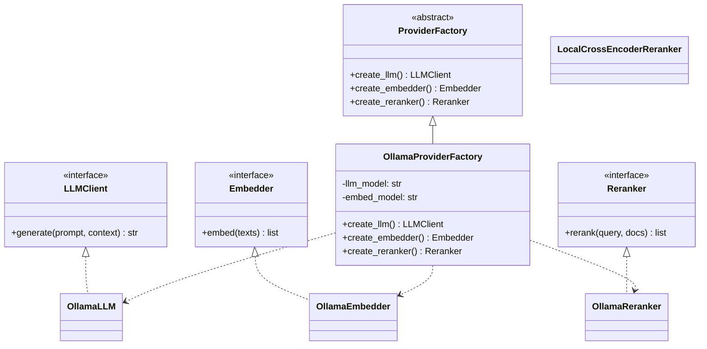

```python
from abc import ABC, abstractmethod


class LLMClient(ABC):
    @abstractmethod
    def generate(self, prompt: str, context: list[str]) -> str:
        raise NotImplementedError


class Embedder(ABC):
    @abstractmethod
    def embed(self, texts: list[str]) -> list[list[float]]:
        raise NotImplementedError


class Reranker(ABC):
    @abstractmethod
    def rerank(self, query: str, docs: list[str]) -> list[str]:
        raise NotImplementedError


class ProviderFactory(ABC):
    @abstractmethod
    def create_llm(self) -> LLMClient: ...
    @abstractmethod
    def create_embedder(self) -> Embedder: ...
    @abstractmethod
    def create_reranker(self) -> Reranker: ...


class OllamaLLM(LLMClient):
    def __init__(self, model_name: str = "qwen3-coder") -> None:
        self.model_name = model_name

    def generate(self, prompt: str, context: list[str]) -> str:
        # Заглушка под ollama.generate(...)
        return f"[Ollama:{self.model_name}] {prompt} | ctx={len(context)}"


class OllamaEmbedder(Embedder):
    def __init__(self, model_name: str = "qwen3-embedder") -> None:
        self.model_name = model_name

    def embed(self, texts: list[str]) -> list[list[float]]:
        # Заглушка под ollama embeddings
        return [[0.1, 0.2, 0.3] for _ in texts]


class OllamaReranker(Reranker):
    def rerank(self, query: str, docs: list[str]) -> list[str]:
        # Заглушка под локальный reranker
        return docs[:]


class OllamaProviderFactory(ProviderFactory):
    def __init__(
        self,
        llm_model: str = "qwen3-coder",
        embed_model: str = "qwen3-embedder",
    ) -> None:
        self.llm_model = llm_model
        self.embed_model = embed_model

    def create_llm(self) -> LLMClient:
        return OllamaLLM(model_name=self.llm_model)

    def create_embedder(self) -> Embedder:
        return OllamaEmbedder(model_name=self.embed_model)

    def create_reranker(self) -> Reranker:
        return OllamaReranker()


class RAGService:
    def __init__(self, factory: ProviderFactory) -> None:
        self.llm = factory.create_llm()
        self.embedder = factory.create_embedder()
        self.reranker = factory.create_reranker()

    def answer(self, query: str, retrieved_docs: list[str]) -> str:
        ranked = self.reranker.rerank(query, retrieved_docs)
        return self.llm.generate(query, ranked)
```

### **Builder (Строитель)**
Отделяет процесс пошагового создания сложного объекта от его представления, позволяя получать разные конфигурации одного и того же объекта.

В системе RAG паттерн применяется для сборки пайплайна индексирования.
Пайплайн состоит из нескольких взаимозаменяемых компонентов:
- Reader
- Chunker
- Embedder
- VectorStore

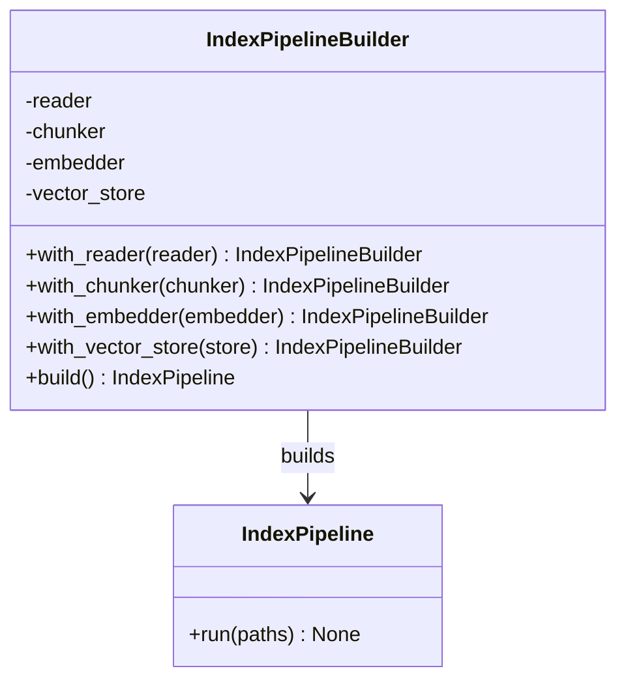

```python
from dataclasses import dataclass
from typing import Protocol, Iterable


class Reader(Protocol):
    def read(self, path: str) -> str: ...


class Chunker(Protocol):
    def split(self, text: str) -> list[str]: ...


class Embedder(Protocol):
    def embed(self, texts: list[str]) -> list[list[float]]: ...


class VectorStore(Protocol):
    def upsert(self, vectors: list[list[float]], payloads: list[dict]) -> None: ...


@dataclass
class IndexPipeline:
    reader: Reader
    chunker: Chunker
    embedder: Embedder
    vector_store: VectorStore

    def run(self, paths: Iterable[str]) -> None:
        for path in paths:
            text = self.reader.read(path)
            chunks = self.chunker.split(text)
            vectors = self.embedder.embed(chunks)
            payloads = [{"path": path, "chunk_id": i} for i, _ in enumerate(chunks)]
            self.vector_store.upsert(vectors, payloads)


class IndexPipelineBuilder:
    def __init__(self) -> None:
        self._reader = None
        self._chunker = None
        self._embedder = None
        self._vector_store = None

    def with_reader(self, reader: Reader) -> "IndexPipelineBuilder":
        self._reader = reader
        return self

    def with_chunker(self, chunker: Chunker) -> "IndexPipelineBuilder":
        self._chunker = chunker
        return self

    def with_embedder(self, embedder: Embedder) -> "IndexPipelineBuilder":
        self._embedder = embedder
        return self

    def with_vector_store(self, store: VectorStore) -> "IndexPipelineBuilder":
        self._vector_store = store
        return self

    def build(self) -> IndexPipeline:
        if not all([self._reader, self._chunker, self._embedder, self._vector_store]):
            raise ValueError("Pipeline is not fully configured")
        
        return IndexPipeline(
            reader=self._reader,
            chunker=self._chunker,
            embedder=self._embedder,
            vector_store=self._vector_store,
        )
```

### **Factory Method (Фабричный метод)**
Определяет интерфейс для создания объекта, позволяя подклассам или фабрике выбирать конкретный класс создаваемого объекта.

В монорепозитории встречаются разные типы артефактов (.py, .md, .yaml, .json).
Паттерн применяется для выбора подходящего загрузчика/парсера в зависимости от типа файла.

Это позволяет:
- не разносить if/else по коду
- централизовать правила выбора обработчика
- легко добавлять новые типы артефактов

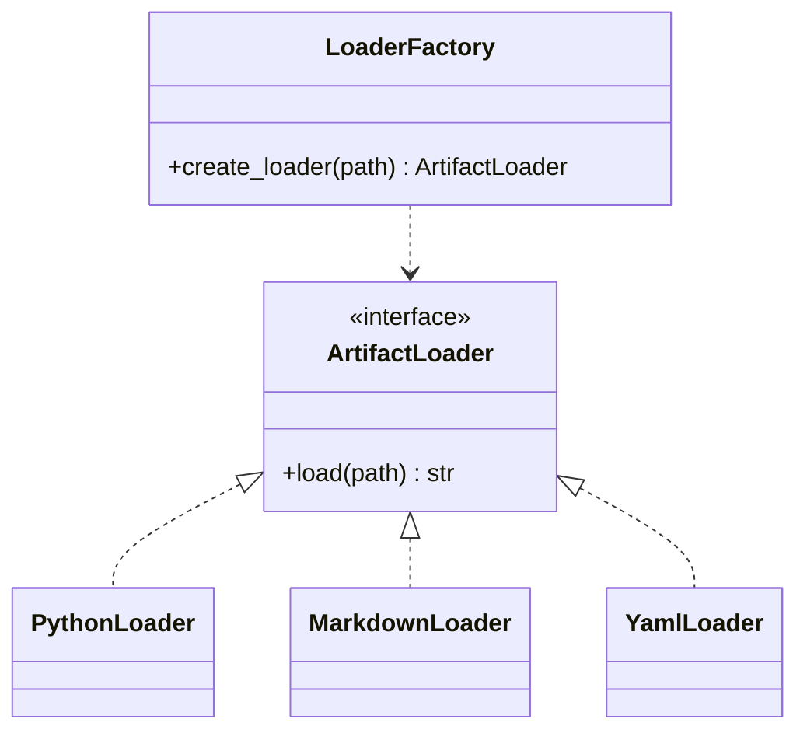

```python
from abc import ABC, abstractmethod
from pathlib import Path


class ArtifactLoader(ABC):
    @abstractmethod
    def load(self, path: Path) -> str:
        raise NotImplementedError


class PythonLoader(ArtifactLoader):
    def load(self, path: Path) -> str:
        return path.read_text(encoding="utf-8")


class MarkdownLoader(ArtifactLoader):
    def load(self, path: Path) -> str:
        return path.read_text(encoding="utf-8")


class YamlLoader(ArtifactLoader):
    def load(self, path: Path) -> str:
        return path.read_text(encoding="utf-8")


class LoaderFactory:
    def create_loader(self, path: Path) -> ArtifactLoader:
        suffix = path.suffix.lower()

        if suffix == ".py":
            return PythonLoader()
        if suffix in {".md", ".markdown"}:
            return MarkdownLoader()
        if suffix in {".yaml", ".yml"}:
            return YamlLoader()

        raise ValueError(f"Unsupported artifact type: {suffix}")


def load_artifact(path: str) -> str:
    file_path = Path(path)
    loader = LoaderFactory().create_loader(file_path)
    return loader.load(file_path)
```

## **Структурные паттерны**
### **Adapter (Адаптер)**
Преобразует интерфейс одного класса в интерфейс, ожидаемый клиентом.

Унифицирует работу с разными векторными БД (Qdrant, pgvector, Milvus) под общий интерфейс VectorStore, чтобы ретривер не зависел от конкретного SDK.

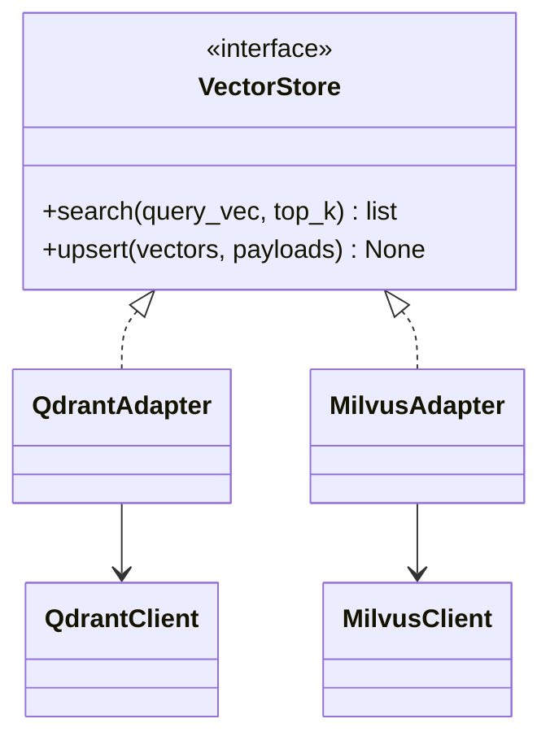

```python
from typing import Protocol, Any


class VectorStore(Protocol):
    def upsert(self, vectors: list[list[float]], payloads: list[dict]) -> None: ...
    def search(self, query_vec: list[float], top_k: int) -> list[dict]: ...


class QdrantClient:
    def upload_points(self, collection: str, points: list[dict]) -> None:
        pass

    def query(self, collection: str, vector: list[float], limit: int) -> list[dict]:
        return [{"id": 1, "score": 0.91, "payload": {"path": "src/a.py"}}]


class QdrantAdapter:
    def __init__(self, client: QdrantClient, collection: str) -> None:
        self._client = client
        self._collection = collection

    def upsert(self, vectors: list[list[float]], payloads: list[dict]) -> None:
        points = [{"vector": v, "payload": p} for v, p in zip(vectors, payloads)]
        self._client.upload_points(self._collection, points)

    def search(self, query_vec: list[float], top_k: int) -> list[dict]:
        return self._client.query(self._collection, query_vec, top_k)
```

### **Facade (Фасад)**
Предоставляет упрощённый интерфейс к сложной подсистеме.

Единая точка входа для сценария “задать вопрос по репозиторию”: ACL → retrieval → reranking → impact analysis → generation → provenance formatting.

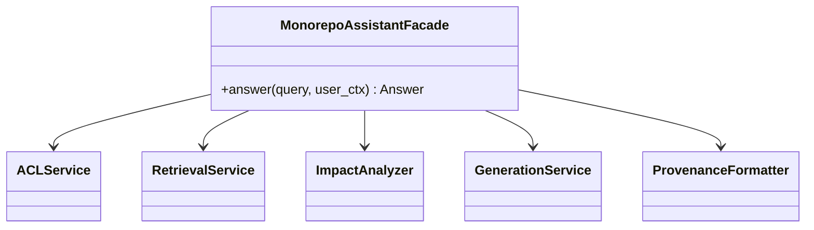

```python
from dataclasses import dataclass


@dataclass
class Answer:
    text: str
    sources: list[dict]
    impacted: list[str]


class ACLService:
    def check(self, user_id: str, repo: str) -> None:
        # В реальности: RBAC/ACL проверка
        return None


class RetrievalService:
    def retrieve(self, query: str) -> list[dict]:
        return [{"path": "src/service.py", "snippet": "def process(...): ..."}]


class ImpactAnalyzer:
    def estimate(self, query: str, docs: list[dict]) -> list[str]:
        return ["src/service.py", "src/retriever.py"]


class GenerationService:
    def generate(self, query: str, docs: list[dict], impacted: list[str]) -> str:
        return f"Ответ по запросу '{query}'. Потенциально затронуты: {', '.join(impacted)}."


class ProvenanceFormatter:
    def format(self, docs: list[dict]) -> list[dict]:
        return [{"file": d["path"], "anchor": 1} for d in docs]


class MonorepoAssistantFacade:
    def __init__(
        self,
        acl: ACLService,
        retrieval: RetrievalService,
        impact: ImpactAnalyzer,
        generation: GenerationService,
        provenance: ProvenanceFormatter,
    ) -> None:
        self.acl = acl
        self.retrieval = retrieval
        self.impact = impact
        self.generation = generation
        self.provenance = provenance

    def answer(self, query: str, user_id: str, repo: str) -> Answer:
        self.acl.check(user_id, repo)
        docs = self.retrieval.retrieve(query)
        impacted = self.impact.estimate(query, docs)
        text = self.generation.generate(query, docs, impacted)
        sources = self.provenance.format(docs)
        return Answer(text=text, sources=sources, impacted=impacted)
```

### **Composite (Компоновщик)**
Позволяет работать с отдельными объектами и их композициями одинаково.

Представление дерева монорепозитория (директории + файлы) и выполнение общих операций: обход, подсчёт, сбор путей для индексирования, фильтрация по зонам изменений.

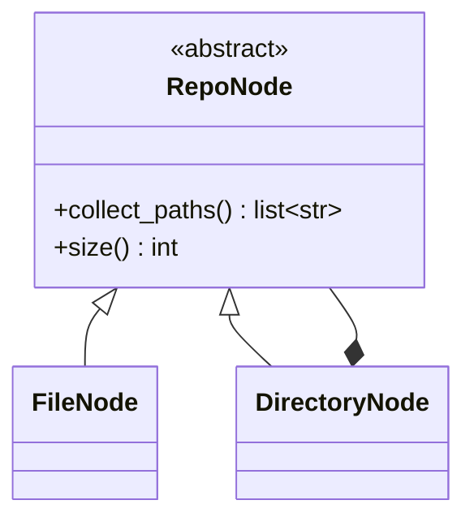

```python
from abc import ABC, abstractmethod


class RepoNode(ABC):
    @abstractmethod
    def collect_paths(self) -> list[str]:
        raise NotImplementedError

    @abstractmethod
    def size(self) -> int:
        raise NotImplementedError


class FileNode(RepoNode):
    def __init__(self, path: str, bytes_count: int) -> None:
        self.path = path
        self.bytes_count = bytes_count

    def collect_paths(self) -> list[str]:
        return [self.path]

    def size(self) -> int:
        return self.bytes_count


class DirectoryNode(RepoNode):
    def __init__(self, name: str) -> None:
        self.name = name
        self.children: list[RepoNode] = []

    def add(self, node: RepoNode) -> None:
        self.children.append(node)

    def collect_paths(self) -> list[str]:
        paths: list[str] = []
        for child in self.children:
            paths.extend(child.collect_paths())
        return paths

    def size(self) -> int:
        return sum(child.size() for child in self.children)
```

### **Decorator (Декоратор)**
Динамически добавляет объекту новую функциональность без изменения его класса.

Оборачивание ретривера дополнительными возможностями: логирование, метрики, кэширование, трассировка, ретраи.

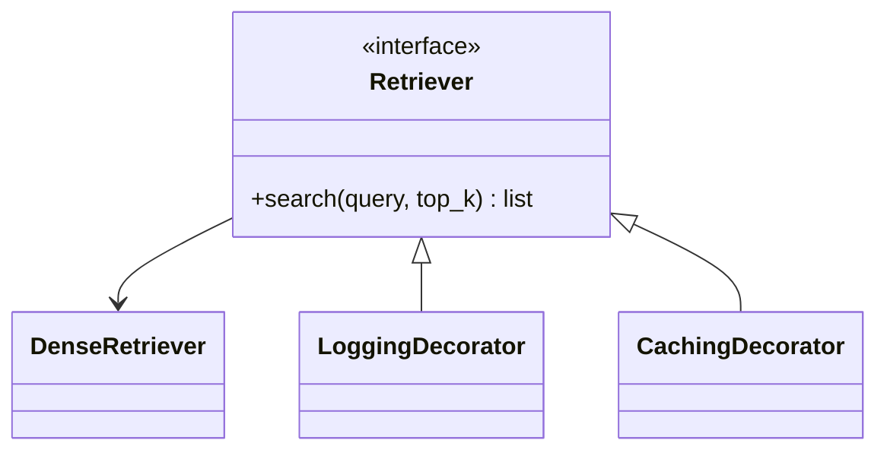

```python
from abc import ABC, abstractmethod


class Retriever(ABC):
    @abstractmethod
    def search(self, query: str, top_k: int = 5) -> list[dict]:
        raise NotImplementedError


class DenseRetriever(Retriever):
    """Базовый retriever (что именно декорируем)."""
    def search(self, query: str, top_k: int = 5) -> list[dict]:
        # Заглушка: в реальности здесь векторный поиск
        return [
            {"doc_id": i, "score": round(1.0 / (i + 1), 3), "query": query}
            for i in range(top_k)
        ]


class LoggingDecorator(Retriever):
    def __init__(self, wrapped: Retriever) -> None:
        self._wrapped = wrapped

    def search(self, query: str, top_k: int = 5) -> list[dict]:
        print(f"[LOG] search started: query={query!r}, top_k={top_k}")
        result = self._wrapped.search(query, top_k)
        print(f"[LOG] search finished: hits={len(result)}")
        return result


class CachingDecorator(Retriever):
    def __init__(self, wrapped: Retriever) -> None:
        self._wrapped = wrapped
        self._cache: dict[tuple[str, int], list[dict]] = {}

    def search(self, query: str, top_k: int = 5) -> list[dict]:
        key = (query, top_k)

        if key in self._cache:
            print("[CACHE] hit")
            return self._cache[key]

        print("[CACHE] miss")
        result = self._wrapped.search(query, top_k)
        self._cache[key] = result
        return result
```

## **Поведенческие паттерны**
### **Strategy (Стратегия)**
Определяет семейство алгоритмов, инкапсулирует каждый и делает их взаимозаменяемыми.

Разные стратегии чанкинга/поиска/оценки влияния в зависимости от типа артефакта и сценария запроса (навигация, impact analysis, обзор документации).

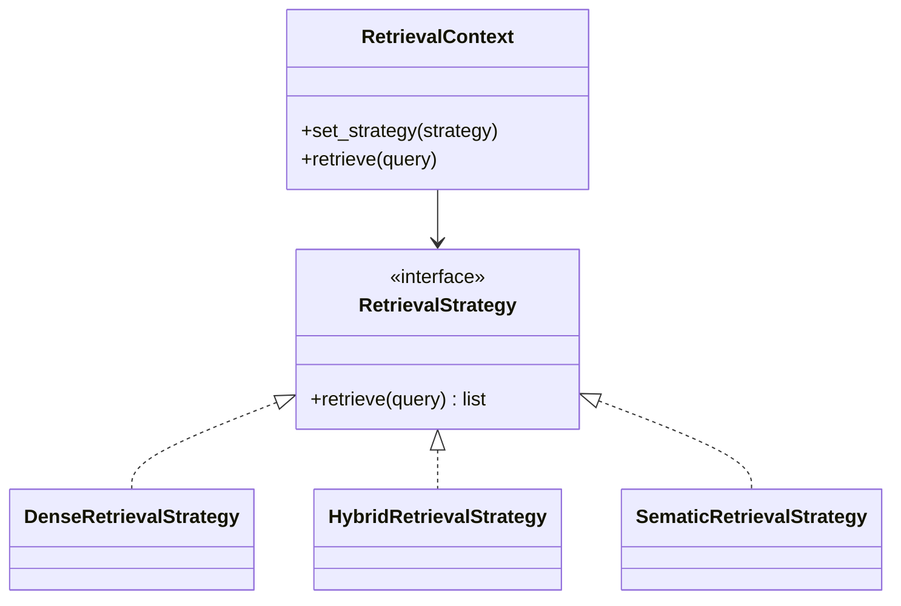

```python
from abc import ABC, abstractmethod


class RetrievalStrategy(ABC):
    @abstractmethod
    def retrieve(self, query: str) -> list[dict]:
        raise NotImplementedError


class DenseRetrievalStrategy(RetrievalStrategy):
    def retrieve(self, query: str) -> list[dict]:
        return [{"mode": "dense", "query": query}]


class HybridRetrievalStrategy(RetrievalStrategy):
    def retrieve(self, query: str) -> list[dict]:
        return [{"mode": "hybrid", "query": query}]


class SemanticRetrievalStrategy(RetrievalStrategy):
    def retrieve(self, query: str) -> list[dict]:
        return [{"mode": "semantic", "query": query}]


class RetrievalContext:
    def __init__(self, strategy: RetrievalStrategy) -> None:
        self._strategy = strategy

    def set_strategy(self, strategy: RetrievalStrategy) -> None:
        self._strategy = strategy

    def retrieve(self, query: str) -> list[dict]:
        return self._strategy.retrieve(query)
```

### **Chain of Responsibility (Цепочка обязанностей)**
Передаёт запрос по цепочке обработчиков, пока один из них не обработает его (или не дополнит контекст).

Пайплайн обработки пользовательского запроса: validation → retrieval → reranking → grounding checks.

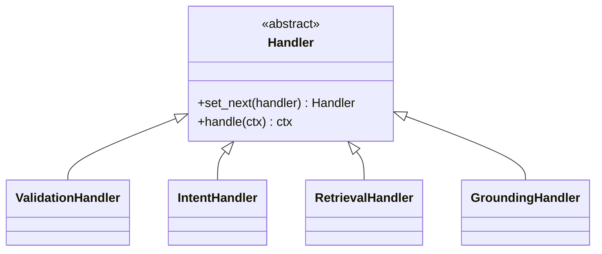

```python
from abc import ABC, abstractmethod
from typing import Any


class Handler(ABC):
    def __init__(self) -> None:
        self._next: Handler | None = None

    def set_next(self, handler: "Handler") -> "Handler":
        self._next = handler
        return handler

    def _forward(self, ctx: dict[str, Any]) -> dict[str, Any]:
        if self._next:
            return self._next.handle(ctx)
        return ctx

    @abstractmethod
    def handle(self, ctx: dict[str, Any]) -> dict[str, Any]:
        raise NotImplementedError


class ValidationHandler(Handler):
    def handle(self, ctx: dict[str, Any]) -> dict[str, Any]:
        if not ctx.get("query"):
            raise ValueError("Empty query")
        return self._forward(ctx)


class IntentHandler(Handler):
    def handle(self, ctx: dict[str, Any]) -> dict[str, Any]:
        q = ctx["query"].lower()
        ctx["intent"] = "impact" if "влияни" in q or "impact" in q else "navigation"
        return self._forward(ctx)


class RetrievalHandler(Handler):
    def handle(self, ctx: dict[str, Any]) -> dict[str, Any]:
        ctx["docs"] = [{"path": "src/app.py", "score": 0.9}]
        return self._forward(ctx)


class GroundingHandler(Handler):
    def handle(self, ctx: dict[str, Any]) -> dict[str, Any]:
        ctx["grounded"] = len(ctx.get("docs", [])) > 0
        return self._forward(ctx)
```

### **Observer (Наблюдатель)**
Определяет зависимость «один-ко-многим»: при изменении состояния объекта все подписчики уведомляются автоматически.

После переиндексации/обновления снапшота: инвалидировать кэш, обновить метрики, запустить пересчёт графа зависимостей, отправить событие в мониторинг.

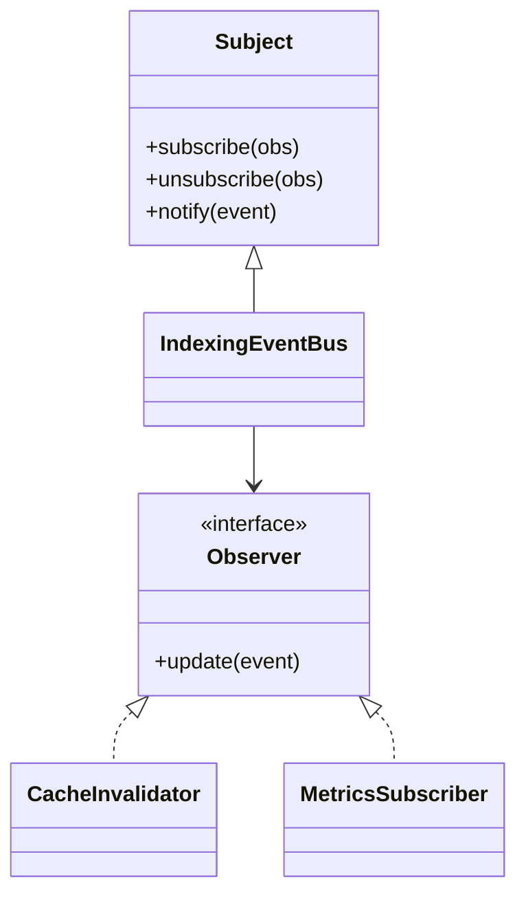

```python
from abc import ABC, abstractmethod


class Observer(ABC):
    @abstractmethod
    def update(self, event: dict) -> None:
        raise NotImplementedError


class IndexingEventBus:
    def __init__(self) -> None:
        self._observers: list[Observer] = []

    def subscribe(self, observer: Observer) -> None:
        self._observers.append(observer)

    def unsubscribe(self, observer: Observer) -> None:
        self._observers.remove(observer)

    def notify(self, event: dict) -> None:
        for obs in self._observers:
            obs.update(event)


class CacheInvalidator(Observer):
    def update(self, event: dict) -> None:
        if event.get("type") == "index_updated":
            print("[CACHE] invalidated")


class MetricsSubscriber(Observer):
    def update(self, event: dict) -> None:
        print(f"[METRICS] event={event.get('type')}")
```

### **Command (Команда)**
Инкапсулирует запрос как объект, позволяя параметризовать клиентов, логировать, откладывать выполнение и комбинировать команды.

Операции обслуживания: ReindexRepository, RecomputeImpactGraph, WarmUpCache, ReembedChangedFiles — удобно для CLI/планировщика/очереди задач.

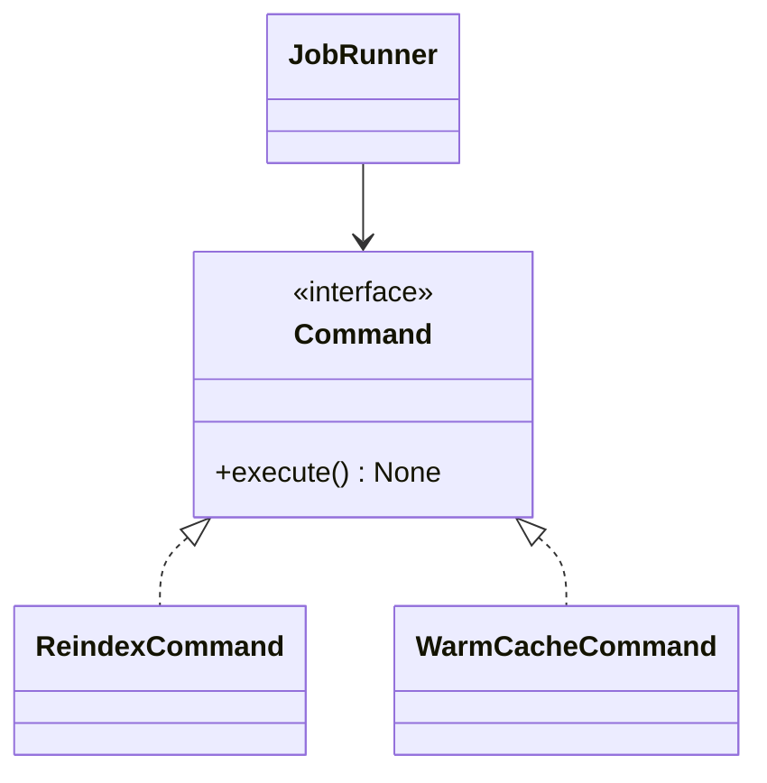

```python
from abc import ABC, abstractmethod


class Command(ABC):
    @abstractmethod
    def execute(self) -> None:
        raise NotImplementedError


class IndexService:
    def reindex(self, repo_path: str) -> None:
        print(f"Reindexing repo: {repo_path}")


class CacheService:
    def warm_up(self) -> None:
        print("Warming up retrieval cache")


class ReindexCommand(Command):
    def __init__(self, index_service: IndexService, repo_path: str) -> None:
        self.index_service = index_service
        self.repo_path = repo_path

    def execute(self) -> None:
        self.index_service.reindex(self.repo_path)


class WarmCacheCommand(Command):
    def __init__(self, cache_service: CacheService) -> None:
        self.cache_service = cache_service

    def execute(self) -> None:
        self.cache_service.warm_up()


class JobRunner:
    def __init__(self) -> None:
        self.queue: list[Command] = []

    def add(self, command: Command) -> None:
        self.queue.append(command)

    def run_all(self) -> None:
        for command in self.queue:
            command.execute()
```

### **Template Method (Шаблонный метод)**
Определяет скелет алгоритма в базовом классе, позволяя подклассам переопределять отдельные шаги.

Единый сценарий индексирования для разных типов источников (локальный FS, Git diff, артефакты CI), при сохранении общей логики: подготовка → чтение → чанкинг → эмбеддинг → сохранение → пост-обработка.

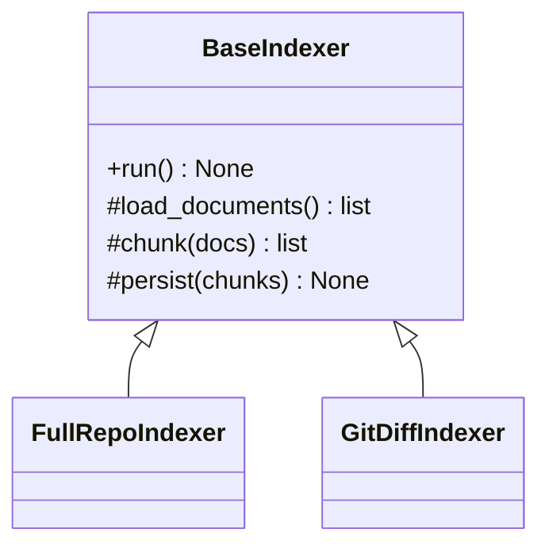

```python
from abc import ABC, abstractmethod


class BaseIndexer(ABC):
    def run(self) -> None:
        docs = self.load_documents()
        chunks = self.chunk(docs)
        vectors = self.embed(chunks)
        self.persist(chunks, vectors)
        self.after_index()

    @abstractmethod
    def load_documents(self) -> list[str]:
        raise NotImplementedError

    def chunk(self, docs: list[str]) -> list[str]:
        # Базовая реализация; можно переопределить
        chunks: list[str] = []
        for d in docs:
            chunks.extend([d[i:i+200] for i in range(0, len(d), 200)])
        return chunks

    def embed(self, chunks: list[str]) -> list[list[float]]:
        return [[0.0, 1.0] for _ in chunks]

    @abstractmethod
    def persist(self, chunks: list[str], vectors: list[list[float]]) -> None:
        raise NotImplementedError


class FullRepoIndexer(BaseIndexer):
    def __init__(self, repo_files: list[str]) -> None:
        self.repo_files = repo_files

    def load_documents(self) -> list[str]:
        return self.repo_files

    def persist(self, chunks: list[str], vectors: list[list[float]]) -> None:
        print(f"Persisted {len(chunks)} chunks for full repo")


class GitDiffIndexer(BaseIndexer):
    def __init__(self, changed_files: list[str]) -> None:
        self.changed_files = changed_files

    def load_documents(self) -> list[str]:
        return self.changed_files

    def persist(self, chunks: list[str], vectors: list[list[float]]) -> None:
        print(f"Persisted {len(chunks)} chunks for changed files only")
```

# **GRASP**
## **Роли**
### **Information Expert (Информационный эксперт)**
Кому назначить ответственность за выполнение операции (например, вычисление списка затронутых файлов после изменения), чтобы не нарушать логику модели предметной области?

Ответственность следует назначать классу, который обладает необходимой информацией.
В системе оценки влияния изменений таким классом является DependencyGraph, так как именно он хранит зависимости между модулями/файлами.

```python
from collections import deque
from dataclasses import dataclass, field
from typing import Deque


@dataclass
class DirectedGraph:
    """
    Ориентированный граф зависимостей.
    adjacency[u] = множество вершин v, в которые ведут рёбра u -> v.
    """
    adjacency: dict[str, set[str]] = field(default_factory=dict)

    def add_vertex(self, vertex: str) -> None:
        self.adjacency.setdefault(vertex, set())

    def add_edge(self, src: str, dst: str) -> None:
        """
        Добавляет ребро src -> dst.
        Для задачи impact analysis удобно хранить ребро:
        changed_file -> dependent_file
        (т.е. если меняется src, потенциально затрагивается dst)
        """
        self.add_vertex(src)
        self.add_vertex(dst)
        self.adjacency[src].add(dst)

    def neighbors(self, vertex: str) -> set[str]:
        return self.adjacency.get(vertex, set())


class DependencyGraph:
    """
    Обёртка над графом зависимостей для задач оценки влияния изменений.
    """
    def __init__(self, graph: DirectedGraph) -> None:
        self._graph = graph

    def impacted_by(self, changed_files: list[str]) -> set[str]:
        """
        Возвращает множество файлов, потенциально затронутых изменениями,
        включая сами изменённые файлы.
        Алгоритм: обход в ширину (BFS) по графу зависимостей.
        """
        impacted: set[str] = set()
        q: Deque[str] = deque()

        # Инициализация очереди
        for file_path in changed_files:
            if file_path not in impacted:
                impacted.add(file_path)
                q.append(file_path)

        # BFS
        while q:
            current = q.popleft()  # реальная очередь O(1)
            for dependent in self._graph.neighbors(current):
                if dependent not in impacted:
                    impacted.add(dependent)
                    q.append(dependent)

        return impacted
```

Результаты:
- Логика вычисления располагается рядом с данными, на которых она основана;
- Уменьшается дублирование в сервисах;
- Упрощается тестирование и сопровождение.

Связи:
- Связан с High Cohesion (высокая связность обязанностей внутри класса);
- Поддерживает Low Coupling, так как внешний код не знает деталей хранения зависимостей.

### **Creator (Создатель)**
Какому классу поручить создание объектов (например, чанков для индексации), чтобы избежать хаотичного создания объектов в разных местах кода?

Создание объекта следует назначить классу, который:
- агрегирует создаваемые объекты
- тесно их использует
- располагает данными для их инициализации

В RAG-системе это может быть DocumentProcessor

```python
from dataclasses import dataclass


@dataclass
class Chunk:
    file_path: str
    text: str
    start_line: int
    end_line: int


class DocumentProcessor:
    def __init__(self, file_path: str, content: str) -> None:
        self._file_path = file_path
        self._content = content

    def create_chunks(self, lines_per_chunk: int = 20) -> list[Chunk]:
        lines = self._content.splitlines()
        chunks: list[Chunk] = []

        for i in range(0, len(lines), lines_per_chunk):
            part = lines[i:i + lines_per_chunk]
            chunks.append(
                Chunk(
                    file_path=self._file_path,
                    text="\n".join(part),
                    start_line=i + 1,
                    end_line=min(i + lines_per_chunk, len(lines)),
                )
            )
        return chunks
```

Результаты:
- объекты создаются в корректном и согласованном состоянии;
- логика создания централизована;
- уменьшается связность остальной системы с деталями инициализации Chunk.

Связи:
- сочетается с GoF Factory Method;
- поддерживает Information Expert (создание там, где есть исходные данные).

### **Controller (Контроллер)**

Куда направить обработку системного события/внешнего запроса (например, пользовательского вопроса к ассистенту), чтобы не смешивать UI/API и бизнес-логику?

Назначить отдельный контроллер, который принимает запрос и делегирует выполнение прикладным сервисам.

```python
class QueryService:
    def execute(self, query: str) -> dict:
        # Заглушка: реальная логика retrieval + generation
        return {
            "answer": f"Ответ на запрос: {query}",
            "sources": ["src/auth/service.py:10-35"]
        }


class QueryController:
    def __init__(self, query_service: QueryService) -> None:
        self._query_service = query_service

    def handle(self, request: dict) -> dict:
        query = request["query"]
        user_id = request.get("user_id", "anonymous")

        # Здесь могут быть ACL-проверка, аудит, валидация
        if not query.strip():
            raise ValueError("Пустой запрос")

        result = self._query_service.execute(query)
        result["handled_by"] = "QueryController"
        result["user_id"] = user_id
        return result
```

Результаты:
- разделяются ответственность API-слоя и бизнес-логики;
- упрощается тестирование use-case;
- формируется единая точка оркестрации сценариев.

Связи:
- связан с Pure Fabrication;
- сочетается с GoF Facade и Command.

### **Pure Fabrication (Искусственный сервис)**

Некоторые обязанности (например, форматирование ссылок на источники, логирование ответа, подготовка JSON для API) не относятся к доменным сущностям, но должны где-то находиться.

Создать искусственный сервисный класс, который не является элементом предметной области, но улучшает архитектуру, вынося техническую логику из доменных объектов.

```python
class ProvenanceFormatter:
    """
    Искусственный сервис для преобразования найденных документов
    в удобный формат ссылок на источники.
    """
    def format_sources(self, docs: list[dict]) -> list[dict]:
        formatted: list[dict] = []

        for d in docs:
            formatted.append({
                "file": d.get("path"),
                "line_from": d.get("line_from", 1),
                "line_to": d.get("line_to", 1),
                "score": d.get("score"),
                "snippet": (d.get("snippet") or "")[:140],
            })

        return formatted

```

Результаты:
- доменные классы не перегружаются техническими обязанностями;
- улучшается High Cohesion;
- становится проще переиспользовать и тестировать инфраструктурный код.

Связи:
- связан с Controller, Low Coupling, High Cohesion;
- часто реализуется вместе с GoF Facade.

### **Indirection (Посредничество)**

Если прикладной сервис напрямую зависит от внешнего SDK (например, Ollama-клиента или SDK векторной БД), изменения внешнего API приводят к каскадным изменениям во внутренней логике.

Ввести промежуточный объект (gateway/adapter/service), через который проходит взаимодействие с внешней системой.

```python
from typing import Protocol


class LLMPort(Protocol):
    def generate(self, prompt: str, context: list[str]) -> str:
        ...


class OllamaClient:
    # Условный внешний клиент
    def chat(self, model: str, messages: list[dict]) -> str:
        return f"[ollama:{model}] messages={len(messages)}"


class OllamaGateway:
    def __init__(self, client: OllamaClient, model: str = "qwen3-coder") -> None:
        self._client = client
        self._model = model

    def generate(self, prompt: str, context: list[str]) -> str:
        messages = [
            {"role": "system", "content": "Answer using only retrieved context."},
            {"role": "user", "content": prompt},
            {"role": "assistant", "content": "\n\n".join(context)},
        ]
        return self._client.chat(model=self._model, messages=messages)


class AnswerService:
    def __init__(self, llm: LLMPort) -> None:
        self._llm = llm

    def answer(self, query: str, snippets: list[str]) -> str:
        return self._llm.generate(query, snippets)
```

Результаты:
- снижается связность бизнес-логики с внешними SDK;
- появляется единая точка для ретраев, таймаутов, логирования и нормализации;
- проще заменить провайдера LLM.

Связи:
- непосредственно связан с Low Coupling;
- реализуется через GoF паттерны Facade и Adapter.

## **Принципы**
### **Low Coupling (Низкая связанность)**

Сильная связанность модулей приводит к хрупкой архитектуре и усложняет замену компонентов.

Зависеть от абстракций (интерфейсов/Protocol), а не от конкретных реализаций.

```python
from typing import Protocol


class VectorStorePort(Protocol):
    def search(self, query_vec: list[float], top_k: int) -> list[dict]:
        ...


class RetrieverService:
    def __init__(self, vector_store: VectorStorePort) -> None:
        self._vector_store = vector_store

    def retrieve(self, query_vec: list[float], top_k: int = 5) -> list[dict]:
        return self._vector_store.search(query_vec, top_k)


class InMemoryVectorStore:
    def search(self, query_vec: list[float], top_k: int) -> list[dict]:
        return [{"path": "README.md", "score": 0.88}]
```

Результаты:
- легче заменить реализацию векторного хранилища;
- снижается количество каскадных изменений.

Связи:
- связан с Indirection;
- реализуется через Adapter.

### **High Cohesion (Высокая связность обязанностей внутри класса)**

Класс "всё-в-одном" плохо читается, сложно тестируется и тяжело расширяется.

Разделить систему на узкоспециализированные компоненты с чёткой ответственностью.

```python
class IntentClassifier:
    def classify(self, query: str) -> str:
        q = query.lower()
        if "влияние" in q or "impact" in q:
            return "impact_analysis"
        return "navigation"


class RetrievalService:
    def retrieve(self, query: str) -> list[dict]:
        return [{"path": "src/api/routes.py", "score": 0.91}]


class AnswerComposer:
    def compose(self, query: str, docs: list[dict]) -> str:
        return f"Ответ на '{query}' сформирован по {len(docs)} источникам."
```

Результаты:
- простота тестирования и сопровождения;
- легкость масштабирования за счет раздельных модулей.

Связи:
- связан с Information Expert и Pure Fabrication.

### **Polymorphism (Полиморфизм)**

Ветвящиеся конструкции if/elif по типам файлов, запросов, стратегий retrieval быстро усложняют код и делают его труднорасширяемым.

Вынести вариативное поведение в общий интерфейс, а конкретные варианты реализовать в отдельных классах.

```python
from abc import ABC, abstractmethod


class ArtifactParser(ABC):
    @abstractmethod
    def parse(self, text: str) -> dict:
        raise NotImplementedError


class PythonParser(ArtifactParser):
    def parse(self, text: str) -> dict:
        return {"kind": "python", "functions_count": text.count("def ")}


class MarkdownParser(ArtifactParser):
    def parse(self, text: str) -> dict:
        return {"kind": "markdown", "headers_count": text.count("#")}


def parse_artifact(parser: ArtifactParser, text: str) -> dict:
    return parser.parse(text)
```

Результаты:
- упрощается добавление новых реализаций;
- снижается количество if/else.

Связи:
- GoF Strategy, Factory Method, Abstract Factory. 

## **Свойства**
### **Protected Variations (Защищённые вариации)**

Система LLM+RAG интегрируется с изменчивыми внешними компонентами:
- LLM-провайдеры
- модели эмбеддингов
- векторные хранилища
- reranker-модели
- источники артефактов (FS/Git/CI)

Если ядро системы напрямую зависит от них, любое изменение приводит к каскадным правкам.

Изолировать изменчивые части за стабильными интерфейсами. Ядро системы работает с контрактами, а конкретные реализации можно заменять без изменения бизнес-логики.

```python
from typing import Protocol


class EmbeddingProvider(Protocol):
    def embed(self, texts: list[str]) -> list[list[float]]:
        ...


class OllamaEmbeddingProvider:
    def embed(self, texts: list[str]) -> list[list[float]]:
        # Заглушка под локальную модель embeddings
        return [[0.1, 0.2, 0.3] for _ in texts]


class MockEmbeddingProvider:
    def embed(self, texts: list[str]) -> list[list[float]]:
        # Удобно для unit-тестов
        return [[0.0, 0.0, 0.0] for _ in texts]


class EmbeddingService:
    def __init__(self, provider: EmbeddingProvider) -> None:
        self._provider = provider

    def embed_chunks(self, chunks: list[str]) -> list[list[float]]:
        return self._provider.embed(chunks)
```

Результаты:
- ядро системы устойчиво к изменениям;
- упрощение тестирования;
- облегчение сопровождения.

Связи:
- Low Coupling и Polymorphism;
- реализуется через GoF Adapter, Strategy;
- усиливается через Indirection.